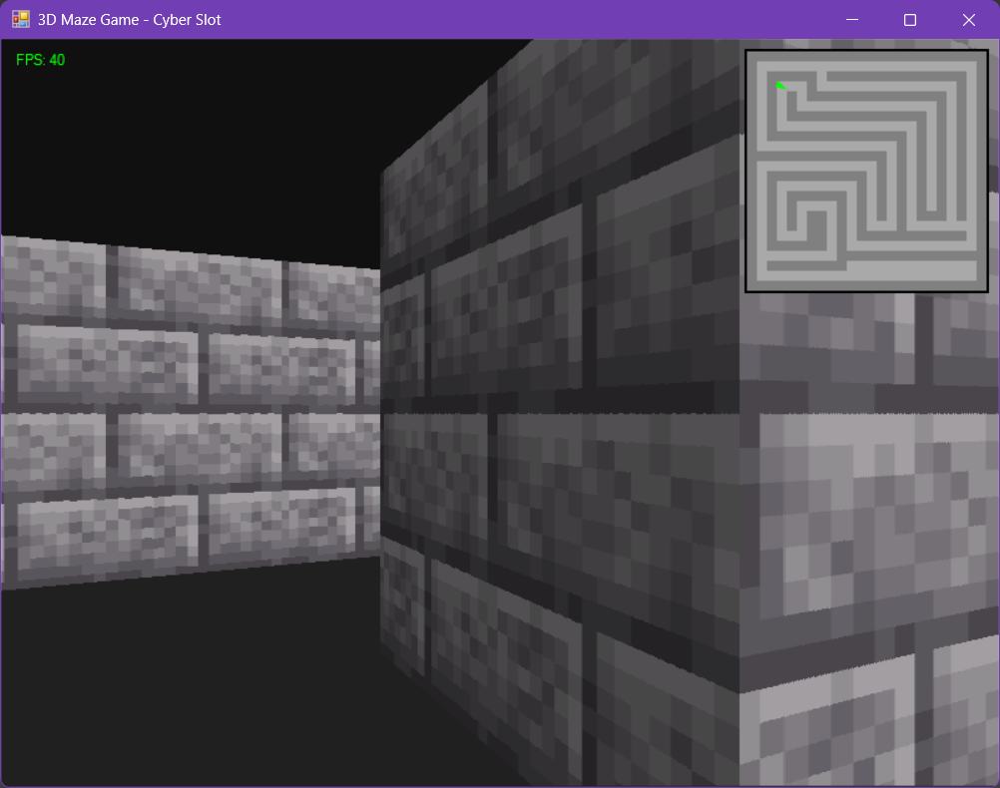

# 🕹️ WinForms 3D Maze Raycasting

**Cyber Slot Presents:** A **classic Wolfenstein 3D-style maze engine** built entirely in **C# WinForms**!  

This project demonstrates **raycasting, texture mapping, and real-time 3D rendering** using only GDI+ — no heavy game engines required. Perfect for learning and experimenting with **retro 3D game development**.

---

## 🎮 Features

- ✅ **3D Maze Rendering** – Raycasting engine with wall textures and shading  
- ✅ **Player Movement** – WASD / Arrow keys, smooth collision detection  
- ✅ **Rotating Player Pointer** – Mini-map with directionally accurate triangle pointer  
- ✅ **Dynamic FPS Counter** – Real-time frame rate display  
- ✅ **Custom Textures** – Add your own `texture.png` or fallback auto-generated texture  
- ✅ **Mini-map Overlay** – Semi-transparent top-right 2D map showing walls & player  

---

## 🕹️ Controls

| Action           | Keys              |
|-----------------|-----------------|
| Move Forward     | W / Up Arrow     |
| Move Backward    | S / Down Arrow   |
| Strafe Left      | A                |
| Strafe Right     | D                |
| Rotate Left      | Q / Left Arrow   |
| Rotate Right     | E / Right Arrow  |

---

## 📷 Screenshots

*Classic retro 3D view with rotating mini-map pointer.*

---

## ⚡ How to Run

1. Just Copy & Paste the `Program.cs` code into your Console/WinForms program and don't forget to put the `texture.png` in the final exe's path.
   
